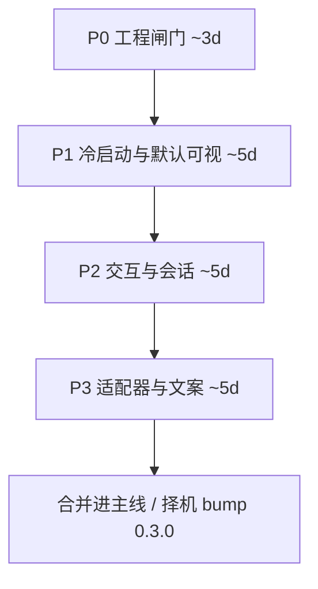

# 优化与扩展技术方案（除暂缓项外）

> 日期：2026-07-30 · 状态：**P0–P3 全部完成**；择机 bump 0.3.0  
> 前置：v0.2.0 帧动画已发布；智能文案旁路（规则/OpenAI，默认关）已落地。  
> 真相源仍以 `进度记录.md` / 代码为准；本文是下一阶段排期与设计。

## 0. 范围

**做：** 工程卫生、应用内 hooks 安装/诊断、默认帧动画与可读性、缩放/重置位置、终态提醒、多会话轻列表、衰减边角、Cursor/Codex 校准与事件补齐、智能文案打磨、皮肤注册表收敛、契约测试。

**明确不做（与 AGENTS.md 一致）：** 多宠、Live2D/Spine、跨平台、像素级点击穿透。

跨阶段硬约束：Push 模型；`pet-bridge` 永远 `exit(0)` + ~1s；单端口 4271；Agent 差异只进 `adapters/`；新 Settings 字段一律 `serde(default)`；按 P0→P3 分 PR，不塞进无关小修复。

---

## P0 — 工程闸门（降发版风险）

### P0.1 CI 质量闸门

- 新增 `.github/workflows/ci.yml`：`push` / `pull_request` → `npm ci` → `npx tsc --noEmit` → `npm test`。
- 改 `.github/workflows/release.yml`：在 `tauri-action` **之前**跑同一套检查。
- 可选：`scripts/check-release-assets.mjs`（校验 draft 含 setup.exe / .sig / latest.json），发版 checklist 或后续接 CI。

### P0.2 版本三处对齐

- 现状：`package.json` / `tauri.conf.json` / `Cargo.toml` = 0.2.0，**`package-lock.json` 顶层仍 0.1.1**。
- `scripts/bump-version.mjs <ver>`：同步三处 + 刷新 lock。
- `scripts/check-versions.mjs`：CI 断言一致。
- 立刻修 lock → 0.2.0（可独立小提交）。

### P0.3 契约测试补齐

| 对象 | 做法 | 入口 |
|------|------|------|
| pet-bridge 零阻塞 | fixture stdin + 不可达端口，断言 exit 0 且耗时 &lt;~1.5s | `adapters/claude-code/pet-bridge.test.mjs` |
| install / uninstall | `os.tmpdir()` 假 home，install→幂等→uninstall | `adapters/*/install-hooks.test.mjs` + 共享 helper |
| HTTP `/event` | 临时端口起 server，fetch ok/dup/400；或 `scripts/smoke-event.mjs` | Rust 测或 Node 冒烟 |
| 工作态迟滞 | 从 `renderer.ts` 抽出 `shouldSkipOutro` / `skipIntro` 纯函数 + vitest | `src/lib/working-churn.ts` |

**验收：** PR 无绿 CI 不可合；上表有测；三处版本与 lock 一致。

---

## P1 — 冷启动与默认可视（用户第一眼）

### P1.1 应用内 Hooks 安装 + 链路诊断（核心）

配置面板新增「Agent 连接」节（`Config.svelte`），经 Rust 调用现有安装器（**不复制 hooks 事件列表**）：

| 命令 | 作用 |
|------|------|
| `install_hooks { source }` | `Command` 跑 `node adapters/<src>/install-hooks.mjs` |
| `uninstall_hooks { source }` | `--uninstall` |
| `hooks_status` | 读三份 hooks 配置是否含 pet-bridge；`node -v` |
| `probe_event_channel` | 本进程 POST `127.0.0.1:4271/event` 测通 |

UI：三源状态灯 + 一键装/卸 + 「推送测试事件」+ 失败文案（无 Node、路径、权限）。

**打包硬要求：** 当前 NSIS 可能不含 `adapters/`。必须 `tauri.conf` `bundle.resources` 纳入 adapters，或构建时复制到 `resource_dir`；安装后 `hooks_status` 能解析到 bridge 绝对路径。

### P1.2 默认皮肤 `green-anim`

- `Settings::default` 的 `skin` 改为 `"green-anim"`；已有 `settings.json` **不强制覆盖**。
- 首次启动（`onboardingDone=false`）：一次性短提示——右键换肤 / 点消散 / 托盘监听会话。

### P1.3 气泡与会话条可读性

- `App.svelte`：气泡略增字号与 `max-width`、允许两行；会话条「来源缩写 + 全部·N」；过滤态更醒目。
- 智能文案开启时仍由 UI 追加「 · 点击消散」。

**验收：** 新装默认帧动画；设置内可装 Claude hooks 并测推成功；旧设置不丢。

---

## P2 — 交互与会话（日常好用）✅ 已完成

### P2.1 缩放 + 重置位置

- Settings：`petScale` 离散档（如 0.75 / 1 / 1.4 → 逻辑边长 150/200/280）。
- `PetRenderer` / canvas / `.pet` CSS + `WebviewWindow::set_size` 联动；`SPRITE_H`/`FRAME_H` 随 scale。
- 菜单「重置位置」→ 主屏右下（抽 `place_default`，复用 setup 坐标逻辑）。
- 配置档位 + 托盘/右键项。

### P2.2 终态更强提醒

- 进入 completed/error：托盘 balloon 或 `request_user_attention`。
- Settings：`terminalNotify` 默认 true，可关；**第一版不加声音**。

### P2.3 多会话轻列表（仍单宠）

- 不改单窗单宠：配置或悬停面板列出会话（复用 `EventRouter::list_sessions`）。
- `invoke("list_sessions")` + 事件/短轮询刷新；点击 → 现有 `session-filter`。
- 托盘「监听会话」保留，列表补可发现性。

### P2.4 衰减 / 过滤边角

- `petState.ts`：过滤模式下 `toIdle` 只清目标会话；`setFilter` 尽量保留目标最近状态。
- 「终态短时不被低优工作态盖住」可选，先测后改聚合，避免回归。

**验收：** 三档缩放热更；重置位置可用；会话可点选；过滤衰减有单测。

---

## P3 — 适配器校准与文案打磨 ✅ 已完成

### P3.1 Cursor / Codex + streaming

- 对照 Claude 15 事件，按 **`PET_DEBUG=1` 真机载荷** 补 Codex（Failure / Subagent / Elicitation 等）与 Cursor 可证实字段；更新 `event-map.mjs` 快照测。
- 设置/README 诚实标注 Cursor「无审批粒度」。
- `streaming`：仅有可靠 hook 才映射；否则保持素材 + 规则文案，不装假状态。
- 校准结论写入 `进度记录.md`。

### P3.2 智能文案打磨（旁路上增强）

- 扩 `rules.ts` 工具别名（Bash/Edit/Write…）。
- OpenAI：配置页展示上次错误；可选 `copyAiTerminalOnly`（仅终态走 API）。
- **仍不做：** 对话窗、TTS、本地大模型常驻。

### P3.3 皮肤注册表收敛

- 单一清单 `src/assets/skins.json`（key / name / poster / frames?）。
- `renderer.ts`、`Config.svelte` 读同一源；Rust 菜单 `skin:*` 动态或由前端广播列表。
- 新皮肤 PR = 清单一条 + 资源，不再三处手写。

**验收：** MAP 测更新；三 Agent 状态灯与文档一致；新皮肤只改清单+资源。

---

## 建议排期与版本

| 阶段 | 约工时 | 建议版本 |
|------|--------|----------|
| P0 | 2–3 天 | 可只合 main，不 bump |
| P1 | 4–6 天 | 0.2.1 或 0.3.0-pre（含 adapters 入包） |
| P2 | 4–6 天 | **0.3.0** |
| P3 | 4–6 天 | 0.3.1 |

单人穿插真机校准约 **3–4 周**。每阶段可独立验收停手。

---

## 风险与缓解

| 风险 | 缓解 |
|------|------|
| 安装版缺 adapters → 应用内安装失败 | P1 强制 resources + 安装后路径自检 |
| 缩放牵动 DPR/拖拽/窗口 | 只提供离散档；改 size 时尽量保中心 |
| 终态通知打扰 | 默认可关；不用声音 |
| Codex/Cursor 字段与文档不符 | 只以真机 debug 日志扩 MAP |
| 范围膨胀 | 严格 P0→P3；本文件为边界 |

---

## 批准后执行顺序

1. **P0**：修 `package-lock` → `ci.yml` → version scripts → pet-bridge / installer / working-churn 测。  
2. **P1**：定 adapters 资源路径 → hooks 面板 → 默认皮肤与可读性。  
3. **P2**：缩放/位置 → 通知 → 会话列表 → 衰减边角。  
4. **P3**：适配器校准 → 文案 → skins.json。

用户确认「从 P0 开始做」后即可开工。
